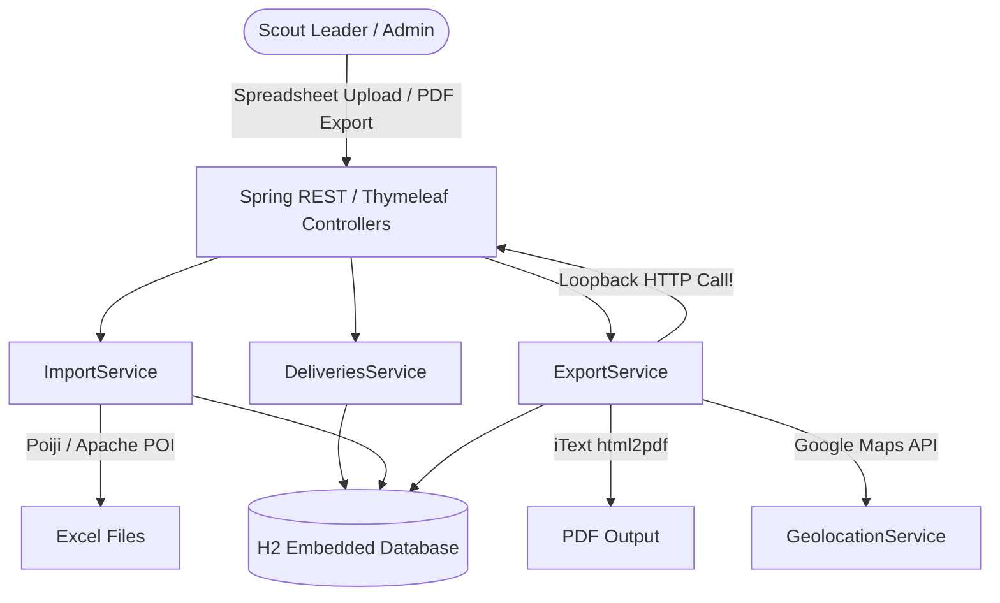
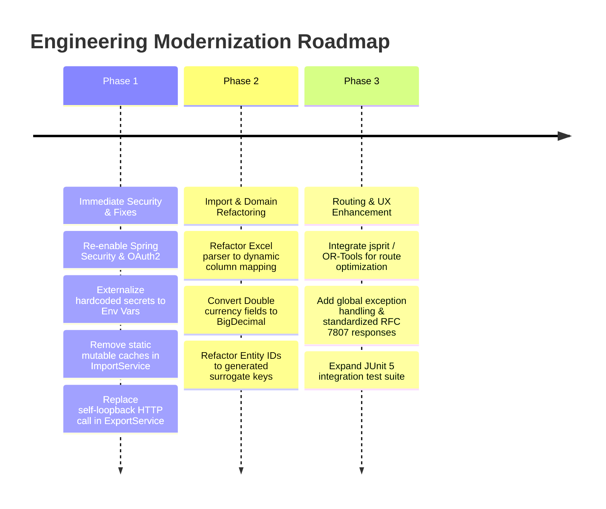

# Principal Engineer Review: Bedding Plants Application

## Executive Summary

The **Bedding Plants** application is a Spring Boot application designed for the 250th Manchester Scout Group. Its primary purpose is to ingest bedding plant sales data from Microsoft Excel spreadsheets, process customer orders and plant catalogs, calculate delivery routes with geolocation (Google Maps), and generate standardized exports (PDF reports, CSV files, and interactive/static maps).

While the application demonstrates a clear domain model and effective library integration (Apache POI/Poiji, iText, Google Maps API, Thymeleaf), it currently exhibits critical architectural bottlenecks, security vulnerabilities (unauthenticated access, hardcoded secrets), thread-safety bugs, and scalability limits in spreadsheet parsing.

---

## 1. Design & Architectural Review

### Key Architectural Strengths
- **Clean Package Organization by Feature/Domain**: Code is logically partitioned into domain packages (`imports`, `exports`, `deliveries`, `geolocation`, `sales`, `orders`, `customers`, `plants`).
- **Data Pipeline**: Smooth end-to-end data pipeline from raw Excel ingestion $\rightarrow$ relational JPA storage $\rightarrow$ geocoding $\rightarrow$ PDF/CSV reporting.
- **H2 Encrypted Persistence**: Production/dev configurations use file-based H2 database with AES encryption enabled on disk (`CIPHER=AES`).

### Critical Architectural Deficiencies

1. **Self-Loopback HTTP Request for PDF Generation**
   - **Issue**: In `ExportService.java` (`executeSaleHtmlExport`), the service uses `RestTemplate` to make an outbound HTTP call to *itself* (`http://localhost:8443/bedding-plants/export/orders/...`) to obtain rendered Thymeleaf HTML, which it then passes to iText `HtmlConverter`.
   - **Impact**: Creates unnecessary I/O overhead, requires an active HTTP listener, hazards thread pool exhaustion/deadlock under concurrent requests, and complicates automated testing.
   - **Recommendation**: Inject `SpringTemplateEngine` directly into `ExportService` to render Thymeleaf templates in-memory without loopback network calls.

2. **Hardcoded Column Limitations & Reflection in Excel Ingestion**
   - **Issue**: `ExcelOrder.java` hardcodes plant columns from `numberPlants1` up to `numberPlants30`. `ImportService` uses reflection (`excelOrder.getClass().getMethod("getNumberPlants" + plantId)`) to read counts.
   - **Impact**: If a sale contains plant ID 31 or higher, reflection fails with `NoSuchMethodException`, breaking imports. Furthermore, reflection per cell adds runtime overhead.
   - **Recommendation**: Refactor Excel ingestion to use dynamic cell mapping (e.g., Apache POI `Cell` iterating over header names) or Poiji's `@ExcelUnknownCells` / custom deserializer to dynamically map plant IDs to quantities.

3. **Mutable Static Caches & Thread Safety Hazards**
   - **Issue**: `ImportService` maintains static mutable collections:
     - `private static final Map<Address, Address> IMPORTED_ADDRESS_CACHE = new HashMap<>(500, 1);`
     - `private static final Map<Method, Method> IMPORT_METHOD_CACHE = new HashMap<>(100, 1);`
   - **Impact**: In a Spring `@Service` (singleton scope), clearing and writing to non-thread-safe `HashMap` instances across HTTP requests creates race conditions, potential corruption during concurrent uploads, and memory leaks.
   - **Recommendation**: Convert caches to request-scoped beans or method-local variables, or use thread-safe data structures (`ConcurrentHashMap`).

4. **Synthetic Primary Keys Defined in Getters**
   - **Issue**: Entity IDs in `Customer` (`getName() + "-" + saleYear`) and `Order` (`saleYear + num`) are computed inside `@Id` getter methods instead of generated sequence/UUID fields.
   - **Impact**: Mutating entity fields (e.g. customer name) prior to persistence alters its `@Id`, confusing Hibernate's identity tracking and state management.
   - **Recommendation**: Use database-generated primary keys (`@GeneratedValue(strategy = GenerationType.IDENTITY)` or UUIDs) and enforce business uniqueness via unique constraints (`@Table(uniqueConstraints = ...)`).

5. **Floating-Point Currency Representation**
   - **Issue**: Order prices, costs, discounts, and VAT are stored using `Double`.
   - **Impact**: Binary floating-point math introduces imprecise rounding artifacts (e.g., `0.1 + 0.2 != 0.3`).
   - **Recommendation**: Standardize on `BigDecimal` or integer minor units (pence/cents as `long`).

---

## 2. Implementation & Code Quality Review

| Area | Current Implementation | Rating | Engineering Recommendation |
| :--- | :--- | :---: | :--- |
| **Java Version & Dependencies** | Java 25 target (`<java.version>25</java.version>`), Spring Boot 4.1.0 | ⚠️ Caution | Standardize build properties on a GA Long Term Support (LTS) release (e.g., Java 21 LTS) and stable Spring Boot 3.x release. |
| **Delivery Route Algorithm** | Basic heuristic in `DeliveriesService` with `TODO` markers for distance grouping | 🚧 Incomplete | Complete distance grouping using Haversine calculation or integrate an open-source Vehicle Routing solver (e.g., **jsprit** or **Google OR-Tools**). |
| **Automated Testing** | 2 test files (`BeddingPlantsApplicationTest` context load, `ImportServiceTest` utility methods) | 🔴 Poor | Implement unit & integration tests covering Excel import edge cases, PDF/CSV generation, repository queries, and controller endpoints. |
| **Error Handling** | Unhandled runtime exceptions propagate raw stack traces | ⚠️ Medium | Implement a global `@ControllerAdvice` / `@RestControllerAdvice` to translate exceptions into standardized Problem Details (RFC 7807) responses. |

---

## 3. Cyber Security Review

### Vulnerabilities Identified

#### A. Total Absence of Authentication & Authorization
- **Status**: Spring Security is commented out in `pom.xml`.
- **Vulnerability**: Every REST API endpoint (`/import/*`, `/export/*`, `/sales/*`, `/orders/*`), Thymeleaf HTML views, and Swagger UI are exposed without authentication.
- **Risk**: Any user on the local network can upload malicious Excel spreadsheets, delete/modify sales data, or download database exports containing personal PII (names, physical addresses, phone numbers, and emails).
- **Remediation**:
  1. Re-enable `spring-boot-starter-security`.
  2. Implement OAuth2 / OIDC authentication (e.g., Google Workspace or Microsoft Azure AD single sign-on) or HTTP Basic Auth for local deployments.
  3. Restrict administrative endpoints (`/import`, `/sales` mutation) to authorized roles.

#### B. Hardcoded Secrets in Source Code & Repository
- **Status**: Database passwords are hardcoded in source property files:
  - `application-dev.properties`: `spring.datasource.password=B3dd!ngP!4nt$ P!4nt$250`
  - `application-release.properties`: `spring.datasource.password=P!4nt$250`
- **Risk**: Hardcoded credentials in source control expose encrypted database files if commits are leaked.
- **Remediation**: Externalize database passwords and Google Maps API keys to environment variables (`${SPRING_DATASOURCE_PASSWORD}`, `${GOOGLE_MAPS_API_KEY}`).

#### C. Open H2 Console & Dev Tools
- **Status**: `spring.h2.console.enabled=true` with path `/h2-console` in dev profile.
- **Risk**: Enables arbitrary SQL execution against the embedded database without authentication.
- **Remediation**: Disable H2 console in production releases and restrict access in dev environments via Spring Security.

---

## 4. Hosting & Deployment Options

Depending on the operational constraints of the Scout Group (budget, technical expertise, accessibility), three primary deployment architectures are recommended:

### Option 1: Containerized Desktop / Local Application (Recommended for Low-Cost Local Use)
- **Architecture**: Package the Spring Boot application into an executable Docker container or native desktop bundle via `jpackage`.
- **Database**: File-based embedded H2 database residing on the local user's machine (`~/bedding-plants/data`).
- **Pros**: Zero cloud running costs, operational offline capability (except Google Maps geocoding), simple local deployment.
- **Cons**: Single-user access at a time; data backup is manual.

### Option 2: Managed Cloud Web App (Recommended for Multi-User Access)
- **Architecture**: Deploy as a container on Google Cloud Run, AWS App Runner, or Fly.io with Google/Microsoft OAuth2 authentication.
- **Database**: Cloud SQL / Managed PostgreSQL or persistent mounted volume for H2.
- **Pros**: Accessible anywhere by Scout leaders on desktop/tablets; central database; automatic backups.
- **Cons**: Small monthly cloud cost ($5–$15/mo depending on usage).

### Option 3: Serverless API + Static Web Frontend
- **Architecture**: Decouple backend into serverless functions (AWS Lambda / Cloud Run) with a lightweight Single Page Application (SPA) frontend hosted on Cloudflare Pages / Vercel.
- **Database**: Serverless relational database (e.g. Neon PostgreSQL or AWS Aurora Serverless).
- **Pros**: Scales to zero cost when inactive between seasonal plant sales.
- **Cons**: Requires full frontend/backend decoupled refactoring.

---

## 5. Strategic Alternatives & Technical Roadmap

### Key Alternatives
1. **Dynamic Excel Parsing Engine**: Replace `Poiji` static mapping with **FastExcel** or **Apache POI Event API** for memory-efficient dynamic column matching.
2. **Vehicle Routing Engine**: Replace manual route heuristics with **jsprit** (Java Open Source Toolkit for Vehicle Routing Problems) to compute mathematically optimal delivery routes based on actual travel distance/time.
3. **In-Memory HTML-to-PDF**: Use `SpringTemplateEngine` + `iText html2pdf` directly in Java memory to eliminate the loopback HTTP dependency completely.
